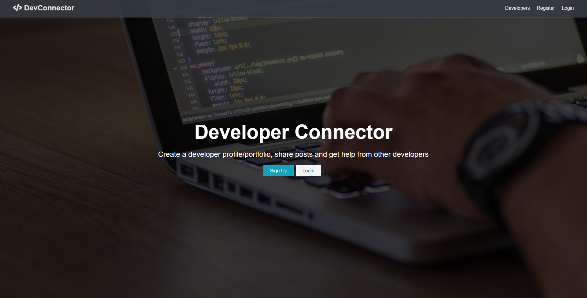

# DevConnector

>Dev Connector Social Media for Developers



# Usage

Rename "config/production.json" to "config/default.json" and update value/settings to your own

## Install Dependencies
```
npm install
```

## Run App
```
# Run in dev mode
npm run dev

# Run in prod mode

npm start
```

### [Live Site](https://ancient-journey-41722.herokuapp.com/)

- Version 1.0.0
- License: MIT
